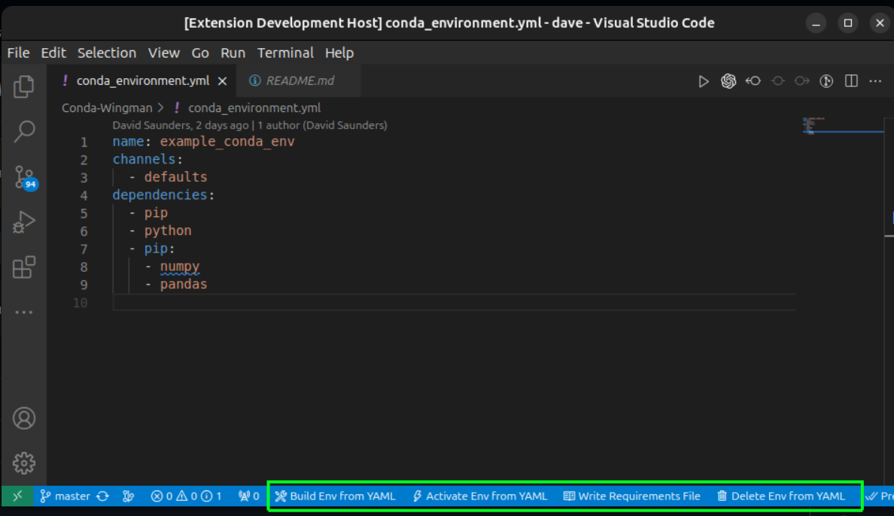
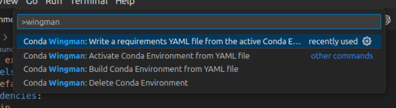

# Conda Wingman


[](https://github.com/DJSaunders1997/Conda-Wingman/blob/main/LICENSE)
[]()
[](https://github.com/DJSaunders1997/Conda-Wingman/actions/workflows/release.yml)


[](https://marketplace.visualstudio.com/items?itemName=djsaunders1997.conda-wingman)
[](https://marketplace.visualstudio.com/items?itemName=djsaunders1997.conda-wingman)
[](https://marketplace.visualstudio.com/items?itemName=djsaunders1997.conda-wingman)


This is the README for the extension [Conda Wingman](https://marketplace.visualstudio.com/items?itemName=DJSaunders1997.conda-wingman).

This extension aims to help VSCode users manage and interact with Conda environments.
Conda Wingman aims to add QoL improvements that help programmers use environments without having to memorise all of the conda commands.

## Features



Conda Wingman dynamically adds status bar items for quick Conda command access when a YAML file is open, simplifying Conda environment management directly within VSCode.

These can also be accessed from the VScode command pallet:


The supported commands are:

### Creating Environments 
- **Command:** Create a Conda environment from the open requirements file by running:
  ```conda env create -f YOUR-REQUIREMENTS.YML```
- **VS Code Command Palette:** `>Conda Wingman: Build Conda Environment from YAML file`

### Activating Environments
- **Command:** Activate an existing Conda environment with:
  ```conda activate YOUR-ENVIRONMENT```
- **VS Code Command Palette:** `>Conda Wingman: Activate Conda Environment`

### Writing Requirements Files
- **Command:** Export the active Conda environment to a requirements file with:
  ```conda env export > YOUR_REQUIREMENTS_FILE```
- **VS Code Command Palette:** `>Conda Wingman: Write a requirements YAML file from the active Conda Environment`

### Deleting Environments
- **Command:** Remove an existing Conda environment by first deactivating, then removing it with:
  ```
  conda deactivate
  conda env remove -n YOUR-ENVIRONMENT
  ```
- **VS Code Command Palette:** `>Conda Wingman: Delete Conda Environment`

## Release Notes

See [CHANGELOG](CHANGELOG.md) for more information.


## Contributing

All contributions are welcome! 
Please feel free to fork the repository and create a pull request.


## License

Distributed under the MIT License. See [LICENSE](LICENSE) for more information.

## Author

David Saunders - 2024
