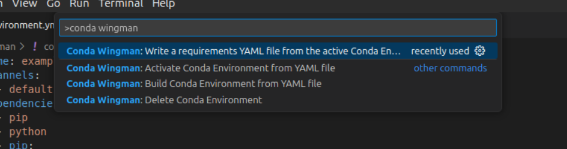

# Conda Wingman


This is the README for the extension [Conda Wingman](https://marketplace.visualstudio.com/items?itemName=DJSaunders1997.conda-wingman).

[](https://marketplace.visualstudio.com/items?itemName=djsaunders1997.conda-wingman)
[](https://marketplace.visualstudio.com/items?itemName=djsaunders1997.conda-wingman)
[](https://marketplace.visualstudio.com/items?itemName=djsaunders1997.conda-wingman)

This extension aims to help VSCode users manage and interact with Conda environments.
Conda Wingman aims to add QoL improvements that help programmers use environments without having to memorise all of the conda commands.

## Features


Conda Wingman dynamically adds status bar items for quick Conda command access when a YAML file is open, simplifying Conda environment management directly within VSCode.

The supported commands are:

### Creating Environments 
- **Command:** Create a Conda environment from the open requirements file by running:
  ```conda env create -f YOUR-REQUIREMENTS.YML```
- **VS Code Command Palette:** `>Conda Wingman: Build Conda Environment from YAML file`

### Activating Environments
- **Command:** Activate an existing Conda environment with:
  ```conda activate YOUR-ENVIRONMENT```
- **VS Code Command Palette:** `>Conda Wingman: Activate Conda Environment`

### Writing Requirements Files
- **Command:** Export the active Conda environment to a requirements file with:
  ```conda env export > YOUR_REQUIREMENTS_FILE```
- **VS Code Command Palette:** `>Conda Wingman: Write a requirements YAML file from the active Conda Environment`

### Deleting Environments
- **Command:** Remove an existing Conda environment by first deactivating, then removing it with:
  ```
  conda deactivate
  conda env remove -n YOUR-ENVIRONMENT
  ```
- **VS Code Command Palette:** `>Conda Wingman: Delete Conda Environment`

## Use
When a YAML file is opened as the active file in the text editor the feature options will be visible in the status bar:


These can also be accessed from the VScode command pallet:


## Release Notes

### 1.0.0
- First official release out of preview!
- Adding `Delete Env` functionality.


### 0.2.1
- Fixed bug that kept wingman status bar items open even when yaml was closed. 

### 0.2.0
- New feature that allows users to activate environments straight from the requirements files by parsing the file.
- New buttons for Activating Envs and Writing requirement files.
- Icon Overhaul for Build Env status bar button.
- Interface added when user writes a requirement file.


### 0.1.0

- Changing to [semantic versioning numbers](https://semver.org/).
Added functionality to create conda environment YAML files from the command pallet. Small update to logo.

### 0.0.2

- Improving readme.
### 0.0.1

- Initial release of extension to VSCode Extension Marketplace


## Author

David Saunders - 2023