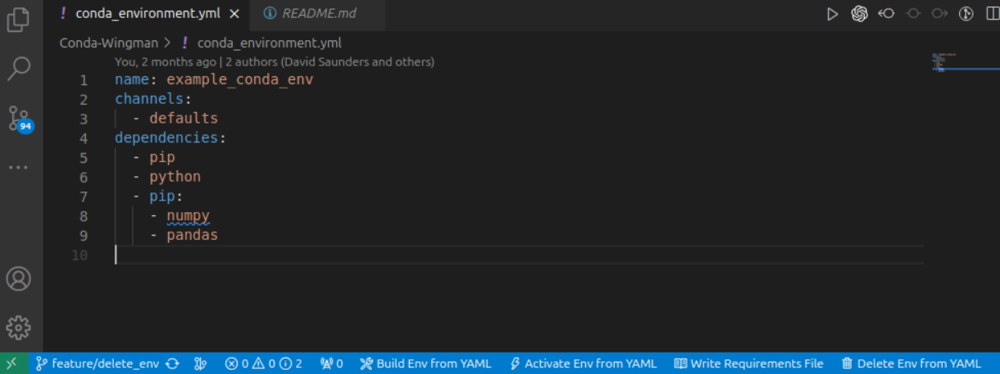

# Conda Wingman


This is the README for the WIP extension [Conda Wingman](https://marketplace.visualstudio.com/items?itemName=DJSaunders1997.conda-wingman).

[](https://marketplace.visualstudio.com/items?itemName=djsaunders1997.conda-wingman)
[](https://marketplace.visualstudio.com/items?itemName=djsaunders1997.conda-wingman)
[](https://marketplace.visualstudio.com/items?itemName=djsaunders1997.conda-wingman)

This extension aims to help VSCode users manage and interact with Conda environments.
Conda Wingman aims to add QoL improvements that help programmers use environments without having to memorise all of the conda commands.

## Features
Currently Conda Wingman features are limited, but with big plans : )

The extension supports the following features at the click of a button / single command:

### Creating Environments 
Create a Conda environment from the open requirements file.
Selecting this will run the command 
```conda env create -f YOUR-REQUIREMENTS.YML```
in the most recently used integrated terminal. If no terminals currently exist the extension will create a new one.

VScode command pallet: ```>Conda Wingman: Build Conda Environment from YAML file```


### Activating Environments
If you've already build the environment, you can instead activate it with another command.
Selecting this will run the command 
```conda activate YOUR-ENVIRONMENT```

VScode command pallet: ```>Conda Wingman: Activate Conda Environment from YAML file```

### Writing Requirements Files

This will output the contents of your active Conda environment to a file of your choice.
Selecting this will run the command 
```conda env export > YOUR_REQUIREMENTS_FILE```
VScode command pallet: ```>Conda Wingman: Write a requirements YAML file from the active Conda Environment```

e.g.
```
name: example_conda_env
channels:
  - defaults
dependencies:
  - ca-certificates=2022.2.1=haa95532_0
  - certifi=2021.10.8=py39haa95532_2
  - openssl=1.1.1m=h2bbff1b_0
  - pip=21.2.4=py39haa95532_0
  - python=3.9.7=h6244533_1
  - setuptools=58.0.4=py39haa95532_0
  - sqlite=3.37.2=h2bbff1b_0
  - tzdata=2021e=hda174b7_0
  - vc=14.2=h21ff451_1
  - vs2015_runtime=14.27.29016=h5e58377_2
  - wheel=0.37.1=pyhd3eb1b0_0
  - wincertstore=0.2=py39haa95532_2
  - pip:
    - numpy==1.22.2
    - pandas==1.4.1
    - python-dateutil==2.8.2
    - pytz==2021.3
    - six==1.16.0
```
When a YAML file is opened as the active file in the text editor the option to create an environment from said file will be shown to the user in the status bar:



Selecting this will run the command 
```conda env create -f YOUR-REQUIREMENTS.YML```
in the most recently used integrated terminal. If no terminals currently exist the extension will create a new one.

The same functionality can also be accessed by running the command ```>Conda Wingman: Build Conda Environment from YAML file``` in VSCode command pallet:


## Release Notes

### 0.2.0
- New feature that allows users to activate environments straight from the requirements files by parsing the file.
- New buttons for Activating Envs and Writing requirement files.
- Icon Overhaul for Build Env status bar button.
- Interface added when user writes a requirement file.


### 0.1.0

- Changing to [semantic versioning numbers](https://semver.org/).
Added functionality to create conda environment YAML files from the command pallet. Small update to logo.

### 0.0.2

- Improving readme.
### 0.0.1

- Initial release of extension to VSCode Extension Marketplace


## Author

David Saunders - 2022